# San Bernardo Package

Paperclip-importable package.

## Import dry-run

```bash
paperclipai company import --from ./companies/san-bernardo --target new --new-company-name "San Bernardo" --include company,agents,skills --dry-run
```

## Real import

```bash
paperclipai company import --from ./companies/san-bernardo --target new --new-company-name "San Bernardo" --include company,agents,skills
```

## Org chart

```mermaid
flowchart TD
  ceo["CEO\nChief Executive Agent"]
  coo["COO\nChief Operating Officer"]
  chief_of_staff["Chief of Staff\nChief of Staff"]
  librarian["Librarian\nSource Librarian"]
  ops_coordinator["Operations Coordinator\nOperations Coordinator"]
  cron_supervisor["Cron Supervisor\nCron and Recurring Work Supervisor"]
  product_production_director["Product Production Director\nProduct and Production Director"]
  tech_pack_auditor["Tech Pack Auditor\nTech Pack Auditor"]
  yarn_materials_researcher["Yarn Materials Researcher\nYarn and Materials Researcher"]
  factory_sourcing_manager["Factory Sourcing Manager\nFactory Sourcing Manager"]
  costing_margin_analyst["Costing Margin Analyst\nCosting and Margin Analyst"]
  quality_control_spec_manager["Quality Control Spec Manager\nQuality Control Spec Manager"]
  ecommerce_growth_director["Ecommerce Growth Director\nEcommerce and Growth Director"]
  shopify_operator["Shopify Operator\nShopify Operator"]
  competitor_monitor["Competitor Monitor\nCompetitor Monitor"]
  customer_support_operator["Customer Support Operator\nCustomer Support and Gorgias Operator"]
  analytics_cro_analyst["Analytics CRO Analyst\nAnalytics and CRO Analyst"]
  creative_director["Creative Director\nCreative Director"]
  editorial_researcher["Editorial Researcher\nEditorial Researcher"]
  photography_producer["Photography Producer\nPhotography Producer"]
  color_packaging_specialist["Color Packaging Specialist\nColor and Packaging Specialist"]
  finance_compliance_director["Finance Compliance Director\nFinance and Compliance Director"]
  tax_vat_monitor["Tax VAT Monitor\nTax and VAT Monitor"]
  bookkeeping_assistant["Bookkeeping Assistant\nBookkeeping Assistant"]
  automation_engineering_director["Automation Engineering Director\nAutomation and Engineering Director"]
  hermes_automation_engineer["Hermes Automation Engineer\nHermes Automation Engineer"]
  browser_cron_operator["Browser Cron Operator\nBrowser Cron Operator"]
  repo_maintenance_worker["Repository Maintenance Worker\nRepository Maintenance Worker"]
  ceo --> coo
  coo --> chief_of_staff
  coo --> librarian
  coo --> ops_coordinator
  coo --> cron_supervisor
  ceo --> product_production_director
  product_production_director --> tech_pack_auditor
  product_production_director --> yarn_materials_researcher
  product_production_director --> factory_sourcing_manager
  product_production_director --> costing_margin_analyst
  product_production_director --> quality_control_spec_manager
  ceo --> ecommerce_growth_director
  ecommerce_growth_director --> shopify_operator
  ecommerce_growth_director --> competitor_monitor
  ecommerce_growth_director --> customer_support_operator
  ecommerce_growth_director --> analytics_cro_analyst
  ceo --> creative_director
  creative_director --> editorial_researcher
  creative_director --> photography_producer
  creative_director --> color_packaging_specialist
  ceo --> finance_compliance_director
  finance_compliance_director --> tax_vat_monitor
  finance_compliance_director --> bookkeeping_assistant
  ceo --> automation_engineering_director
  automation_engineering_director --> hermes_automation_engineer
  automation_engineering_director --> browser_cron_operator
  automation_engineering_director --> repo_maintenance_worker
```


