# San Bernardo Worker Chain of Command — Runtime v10

```mermaid
flowchart TD
    HUMAN["Human Owner<br/>external governance / final approval"] -. approvals .-> CEO["CEO<br/>Paperclip runtime root"]
    CEO --> HERMES["Hermes Agent<br/>main operating orchestrator"]

    HERMES --> CREATIVE["Creative Direction Approval"]
    HERMES --> OPS["Operations Coordinator"]
    HERMES --> LIB["Librarian Worker"]

    CREATIVE --> DESIGN["Design Lead"]
    CREATIVE --> MARKETING["Marketing Lead"]
    CREATIVE --> KNIT["Knitwear Technical Specialist"]
    CREATIVE --> TECHPACK["Tech Pack / Product Development Lead"]
    CREATIVE --> TEMPLATE["Template / Production Designer"]
    CREATIVE --> PACKAGING["Packaging Designer"]

    OPS --> SALES["Sales Director"]
    OPS --> INDUSTRIAL["Industrial Director"]
    OPS --> FINANCE["Commercial Finance Lead"]
    OPS --> DATA["Data / Reporting Operator"]
    OPS --> AUTO["Automation Operator"]
    OPS --> LEGAL["Legal / IP / Corporate Affairs Lead"]

    SALES --> SALESLEAD["Sales Lead"]
    SALES --> B2B["B2B Sales Lead"]
    SALES --> MARKET["Market Research / Directory Research Lead"]
    SALES --> WEB["Web Design / Ecommerce Lead"]
    SALES --> ECOM["Ecommerce Operations Lead"]
    SALES --> CATALOG["Product Catalog Lead"]
    SALES --> CS["Customer Service Lead"]
    SALES --> CUSTSUCCESS["Customer Success / Implementation Lead"]

    INDUSTRIAL --> SUPPLIER["Supplier / Factory Liaison"]
    INDUSTRIAL --> FACTORY["Factory Sourcing Lead"]
    INDUSTRIAL --> PRODPLAN["Production Planning & Technical Lead"]
    INDUSTRIAL --> QC["Quality & Certification Lead"]
    INDUSTRIAL --> CUSTOMS["Customs / Compliance Lead"]
    INDUSTRIAL --> WAREHOUSE["Warehouse Lead"]
    INDUSTRIAL --> PROCUREMENT["Procurement Lead"]

    FINANCE --> COLLECTIONS["Finance / Collections Lead"]
    FINANCE --> TAX["Tax / Accounting Lead"]
    FINANCE --> INVENTORY["Inventory Planner"]
    FINANCE --> BILLING["Billing / Subscription Operations Lead"]

    LIB -. supports .-> CREATIVE
    LIB -. supports .-> OPS
    LIB -. supports .-> SALES
    LIB -. supports .-> INDUSTRIAL
    LIB -. supports .-> FINANCE
```

## Importable Paperclip agents

| # | Worker | Slug | Paperclip API role | Reports to |
|---:|---|---|---|---|
| 1 | CEO | `ceo` | `ceo` | ROOT |
| 2 | Hermes Agent | `hermes-agent` | `general` | `ceo` |
| 3 | Librarian Worker | `librarian-worker` | `researcher` | `hermes-agent` |
| 4 | Operations Coordinator | `operations-coordinator` | `pm` | `hermes-agent` |
| 5 | Sales Director | `sales-director` | `cmo` | `operations-coordinator` |
| 6 | Sales Lead | `sales-lead` | `cmo` | `sales-director` |
| 7 | Web Design / Ecommerce Lead | `web-design-ecommerce-lead` | `designer` | `sales-director` |
| 8 | Automation Operator | `automation-operator` | `devops` | `operations-coordinator` |
| 9 | B2B Sales Lead | `b2b-sales-lead` | `cmo` | `sales-director` |
| 10 | Commercial Finance Lead | `commercial-finance-lead` | `cfo` | `operations-coordinator` |
| 11 | Creative Direction Approval | `creative-direction-approval` | `pm` | `hermes-agent` |
| 12 | Customer Service Lead | `customer-service-lead` | `general` | `sales-director` |
| 13 | Customer Success / Implementation Lead | `customer-success-implementation-lead` | `general` | `sales-director` |
| 14 | Data / Reporting Operator | `data-reporting-operator` | `researcher` | `operations-coordinator` |
| 15 | Design Lead | `design-lead` | `designer` | `creative-direction-approval` |
| 16 | Ecommerce Operations Lead | `ecommerce-operations-lead` | `pm` | `sales-director` |
| 17 | Finance / Collections Lead | `finance-collections-lead` | `cfo` | `commercial-finance-lead` |
| 18 | Industrial Director | `industrial-director` | `pm` | `operations-coordinator` |
| 19 | Inventory Planner | `inventory-planner` | `pm` | `commercial-finance-lead` |
| 20 | Legal / IP / Corporate Affairs Lead | `legal-ip-corporate-affairs-lead` | `general` | `operations-coordinator` |
| 21 | Market Research / Directory Research Lead | `market-research-directory-research-lead` | `researcher` | `sales-director` |
| 22 | Marketing Lead | `marketing-lead` | `cmo` | `creative-direction-approval` |
| 23 | Packaging Designer | `packaging-designer` | `designer` | `creative-direction-approval` |
| 24 | Procurement Lead | `procurement-lead` | `general` | `industrial-director` |
| 25 | Product Catalog Lead | `product-catalog-lead` | `pm` | `sales-director` |
| 26 | Production Planning & Technical Lead | `production-planning-and-technical-lead` | `pm` | `industrial-director` |
| 27 | Quality & Certification Lead | `quality-and-certification-lead` | `qa` | `industrial-director` |
| 28 | Supplier / Factory Liaison | `supplier-factory-liaison` | `general` | `industrial-director` |
| 29 | Tax / Accounting Lead | `tax-accounting-lead` | `cfo` | `commercial-finance-lead` |
| 30 | Tech Pack / Product Development Lead | `tech-pack-product-development-lead` | `pm` | `creative-direction-approval` |
| 31 | Template / Production Designer | `template-production-designer` | `designer` | `creative-direction-approval` |
| 32 | Knitwear Technical Specialist | `knitwear-technical-specialist` | `researcher` | `creative-direction-approval` |
| 33 | Warehouse Lead | `warehouse-lead` | `general` | `industrial-director` |
| 34 | Billing / Subscription Operations Lead | `billing-subscription-operations-lead` | `cfo` | `commercial-finance-lead` |
| 35 | Customs / Compliance Lead | `customs-compliance-lead` | `general` | `industrial-director` |
| 36 | Factory Sourcing Lead | `factory-sourcing-lead` | `researcher` | `industrial-director` |

## Role enum fix

v10 maps all worker roles to Paperclip's accepted role enum while preserving the real business role in worker metadata and instructions.
